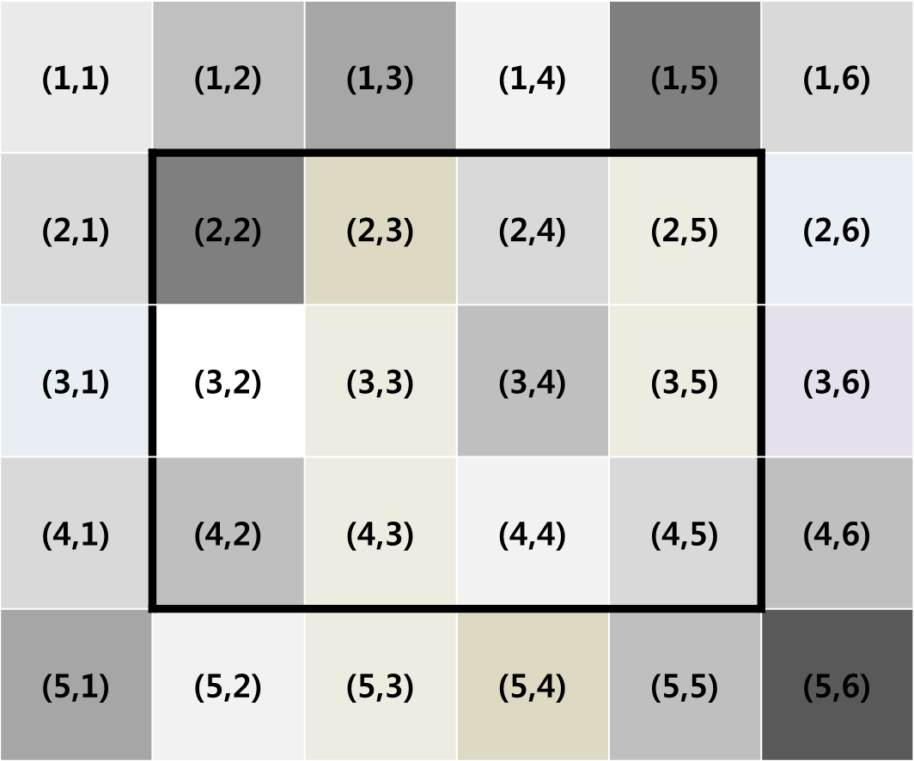

https://www.acmicpc.net/problem/16507

**어두운 건 무서워 (실버 I)**

**문제**

호근이는 겁이 많아 어두운 것을 싫어한다. 호근이에게 어떤 사진을 보여주려는데 사진의 밝기가 평균 이상이 되지 않으면 일절 보려 하지 않는다. 호근이가 이 사진에서 일부분이라도 볼 수 있는 부분을 찾아주자.

위 그림은 호근이에게 보여줄 5×6 크기의 사진이며, 각 픽셀은 밝기를 나타낸다. 호근이가 사진의 일부분이라도 볼 수 있는지 알아보기 위해서는 두 점 (r1, c1)과 (r2, c2)를 꼭짓점으로 하는 직사각형의 밝기 평균을 구해야 한다. 예를 들어, 위 그림에서는 (2, 2)와 (4, 5)를 꼭짓점으로 하는 직사각형을 말한다.

호근이에게 보여줄 R×C 크기의 사진이 주어질 때, 사진의 일부분에 해당하는 밝기 평균을 구하여라.

**입력**

첫 번째 줄에는 사진의 크기를 의미하는 정수 R, C (1 ≤ R, C ≤ 1,000)와 사진 일부분의 밝기 평균을 알아볼 개수를 의미하는 정수 Q (1 ≤ Q ≤ 10,000)가 주어진다.

다음 R개의 줄에 걸쳐 R×C 크기의 사진 정보가 주어지며, 사진의 각 픽셀에는 밝기를 의미하는 정수 K (1 ≤ K ≤ 1,000)가 주어진다.

다음 Q개의 각 줄에는 사진의 일부분을 나타내기 위한 두 꼭짓점을 의미하는 정수 r1, c1, r2, c2 (1 ≤ r1 ≤ r2 ≤ R, 1 ≤ c1 ≤ c2 ≤ C)가 주어진다.

**출력**

Q개의 각 줄에 주어진 사진에서 두 점 (r1, c1)과 (r2, c2)를 꼭짓점으로 하는 직사각형의 밝기 평균을 출력한다. 평균은 정수 나눗셈으로 몫만 취한다.

**Cases**

5 6 1 
4 1 3 4 9 5 
1 2 8 7 5 5 
8 1 2 5 3 2 
1 5 3 4 2 5 
5 2 1 2 3 5 
2 2 4 5 
output : 3

4 3 5 
25 93 64 
10 29 85 
80 63 71 
99 58 86 
2 2 2 3 
3 2 3 3 
1 2 2 2 
1 2 4 3 
2 3 2 3 
output : 
57 
67 
61 
68 
85

**알고리즘 분류**

- 누적 합