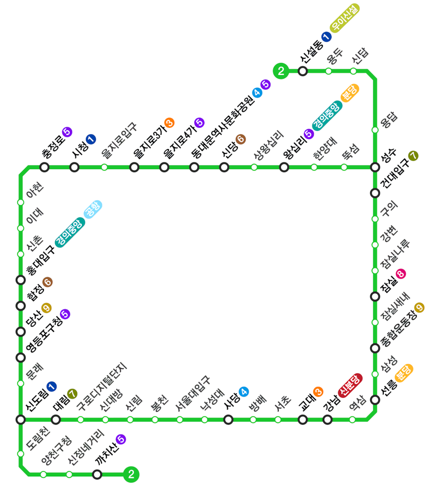

https://www.acmicpc.net/problem/16947

**서울 지하철 2호선**

| 시간 제한	 | 메모리 제한 |
|--------|--------|
| 2 초	   | 512 MB |

**문제**

서울 지하철 2호선은 다음과 같이 생겼다.

지하철 2호선에는 51개의 역이 있고, 역과 역 사이를 연결하는 구간이 51개 있다. 즉, 정점이 51개이고, 양방향 간선이 51개인 그래프로 나타낼 수 있다. 2호선은 순환선 1개와 2개의 지선으로 이루어져 있다. 한 역에서 출발해서 계속 가면 다시 출발한 역으로 돌아올 수 있는 노선을 순환선이라고 한다. 지선은 순환선에 속하는 한 역에서 시작하는 트리 형태의 노선이다.

두 역(정점) 사이의 거리는 지나야 하는 구간(간선)의 개수이다. 역 A와 순환선 사이의 거리는 A와 순환선에 속하는 역 사이의 거리 중 최솟값이다.

지하철 2호선과 같은 형태의 노선도가 주어졌을 때, 각 역과 순환선 사이의 거리를 구해보자.

**입력**

첫째 줄에 역의 개수 N(3 ≤ N ≤ 3,000)이 주어진다. 둘째 줄부터 N개의 줄에는 역과 역을 연결하는 구간의 정보가 주어진다. 같은 구간이 여러 번 주어지는 경우는 없고, 역은 1번부터 N번까지 번호가 매겨져 있다. 임의의 두 역 사이에 경로가 항상 존재하는 노선만 입력으로 주어진다.

**출력**

총 N개의 정수를 출력한다. 1번 역과 순환선 사이의 거리, 2번 역과 순환선 사이의 거리, ..., N번 역과 순환선 사이의 거리를 공백으로 구분해 출력한다.

4 
1 3 
4 3 
4 2 
1 2 
output : 0 0 0 0

6 
1 2 
3 4 
6 4 
2 3 
1 3 
3 5 
output : 0 0 0 1 1 2

12 
1 3 
3 4 
4 5 
5 6 
6 7 
7 8 
8 4 
2 3 
7 9 
9 12 
7 10 
10 11 
output : 2 2 1 0 0 0 0 0 1 1 2 2

**알고리즘 분류**

- 그래프 이론
- 그래프 탐색
- 너비 우선 탐색
- 깊이 우선 탐색