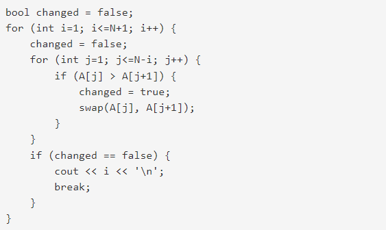

https://www.acmicpc.net/problem/1377

**버블 소트 (골드 II)**

**문제**

버블 소트 알고리즘을 다음과 같이 C++로 작성했다. 

위 소스에서 N은 배열의 크기이고, A는 정렬해야 하는 배열이다. 배열은 A[1]부터 사용한다.

위와 같은 소스를 실행시켰을 때, 어떤 값이 출력되는지 구해보자.

**입력**

첫째 줄에 N이 주어진다. N은 500,000보다 작거나 같은 자연수이다. 둘째 줄부터 N개의 줄에 A[1]부터 A[N]까지 하나씩 주어진다. A에 들어있는 수는 1,000,000보다 작거나 같은 자연수 또는 0이다.

**출력**

정답을 출력한다.

**Cases**

5 
10 
1 
5 
2 
3 
output : 3

5 
1 
3 
5 
7 
9 
output : 1

**알고리즘 분류**

- 정렬