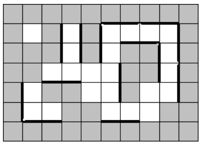

https://www.acmicpc.net/problem/2115

**문제**

갤러리의 지도는 M*N의 정사각형 격자로 표현될 수 있다. 어떤 정사각형들은 벽으로 구성되어 있고, 다른 정사각형들은 빈 공간으로 구성되어 있다. 벽을 회색, 빈 공간을 흰색으로 표현하면 다음 그림과 같다.

갤러리에 그림을 걸려고 한다. 그림의 길이는 정사각형의 변의 길이의 두 배이다. 반드시 빈 공간과 인접해 있는 벽에만 그림을 걸 수 있으며, 그림들은 서로 겹칠 수 없다. 갤러리의 맵이 주어졌을 때, 최대로 걸 수 있는 그림의 개수를 출력하는 프로그램을 작성하시오.

**입력**

첫째 줄에 갤러리의 세로 길이 M과 가로 길이 N이 주어진다. (1 ≤ M, N ≤ 1,000) 다음 M개의 줄에는 각각 N개의 문자가 주어진다. 문자는 'X' 또는 '.'이며 'X'는 벽을, '.'는 빈 공간을 나타낸다.

입력되는 모든 데이터에서 적어도 첫 줄과 마지막 줄, 첫 열과 마지막 열은 모두 벽이다.

**출력**

최대 그림 개수를 출력한다.

**Cases**

3 3 
XXX 
X.X 
XXX 
output : 0

5 5 
XXXXX 
X...X 
X.XXX 
X.X.X 
XXXXX 
output : 4

7 10 
XXXXXXXXXX 
X.X.X....X 
XXX.X.XX.X 
XX....XX.X 
X.XX..X..X 
X..XX...XX 
XXXXXXXXXX 
output : 14

**알고리즘 분류**

- 구현
- 문자열