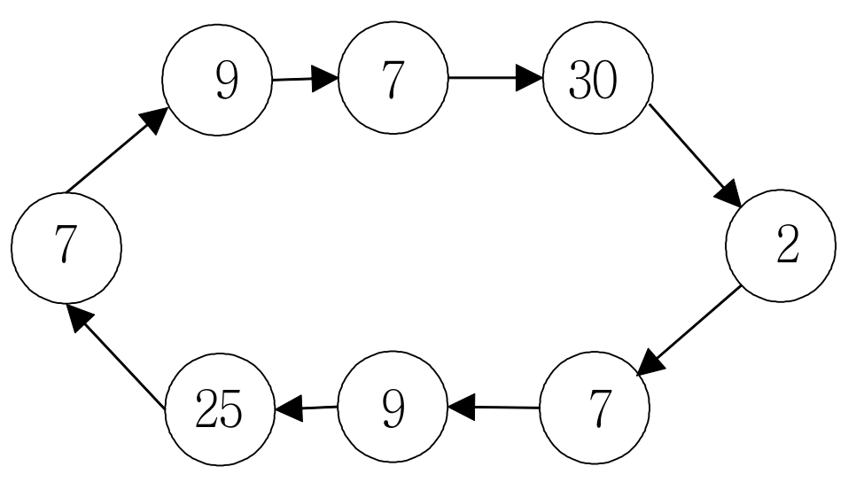

출처 : https://www.acmicpc.net/problem/2531

**문제**

회전 초밥 음식점에는 회전하는 벨트 위에 여러 가지 종류의 초밥이 접시에 담겨 놓여 있고, 손님은 이 중에서 자기가 좋아하는 초밥을 골라서 먹는다. 초밥의 종류를 번호로 표현할 때, 다음 그림은 회전 초밥 음식점의 벨트 상태의 예를 보여주고 있다. 벨트 위에는 같은 종류의 초밥이 둘 이상 있을 수 있다. 

새로 문을 연 회전 초밥 음식점이 불경기로 영업이 어려워서, 다음과 같이 두 가지 행사를 통해서 매상을 올리고자 한다.

1. 원래 회전 초밥은 손님이 마음대로 초밥을  고르고, 먹은 초밥만큼 식대를 계산하지만, 벨트의 임의의 한 위치부터 k개의 접시를 연속해서 먹을 경우 할인된 정액 가격으로 제공한다.
2. 각 고객에게 초밥의 종류 하나가 쓰인 쿠폰을 발행하고, 1번 행사에 참가할 경우 이 쿠폰에 적혀진 종류의 초밥 하나를 추가로 무료로 제공한다. 만약 이 번호에 적혀진 초밥이 현재 벨트 위에 없을 경우, 요리사가 새로 만들어 손님에게 제공한다.

위 할인 행사에 참여하여 가능한 한 다양한 종류의 초밥을 먹으려고 한다. 위 그림의 예를 가지고 생각해보자. k=4이고, 30번 초밥을 쿠폰으로 받았다고 가정하자. 쿠폰을 고려하지 않으면 4가지 다른 초밥을 먹을 수 있는 경우는 (9, 7, 30, 2), (30, 2, 7, 9), (2, 7, 9, 25) 세 가지 경우가 있는데, 30번 초밥을 추가로 쿠폰으로 먹을 수 있으므로 (2, 7, 9, 25)를 고르면 5가지 종류의 초밥을 먹을 수 있다.

회전 초밥 음식점의 벨트 상태, 메뉴에 있는 초밥의 가짓수, 연속해서 먹는 접시의 개수, 쿠폰 번호가 주어졌을 때, 손님이 먹을 수 있는 초밥 가짓수의 최댓값을 구하는 프로그램을 작성하시오.

**입력**

첫 번째 줄에는 회전 초밥 벨트에 놓인 접시의 수 N, 초밥의 가짓수 d, 연속해서 먹는 접시의 수 k, 쿠폰 번호 c가 각각 하나의 빈 칸을 사이에 두고 주어진다. 단, 2 ≤ N ≤ 30,000, 2 ≤ d ≤ 3,000, 2 ≤ k ≤ 3,000 (k ≤ N), 1 ≤ c ≤ d이다. 두 번째 줄부터 N개의 줄에는 벨트의 한 위치부터 시작하여 회전 방향을 따라갈 때 초밥의 종류를 나타내는 1 이상 d 이하의 정수가 각 줄마다 하나씩 주어진다.

**출력**

주어진 회전 초밥 벨트에서 먹을 수 있는 초밥의 가짓수의 최댓값을 하나의 정수로 출력한다.

| 예제 입력 1   | 예제 출력 1 |
|-----------|---------|
| 8 30 4 30 | 5       |
| 7         |         |
| 9         |         |
| 7         |         |
| 30        |         |
| 2         |         |
| 7         |         |
| 9         |         |
| 25        |         |

**알고리즘 분류**

- 브루트포스 알고리즘
- 두 포인터